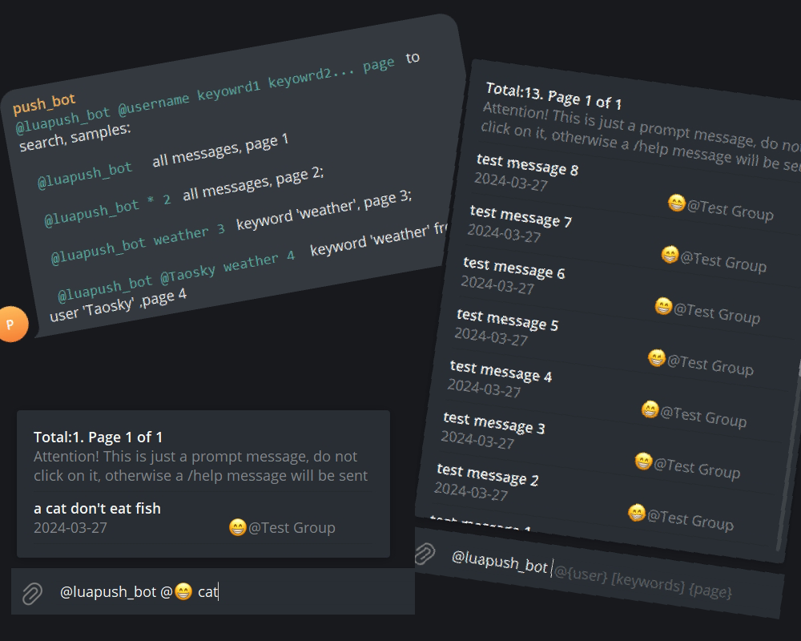
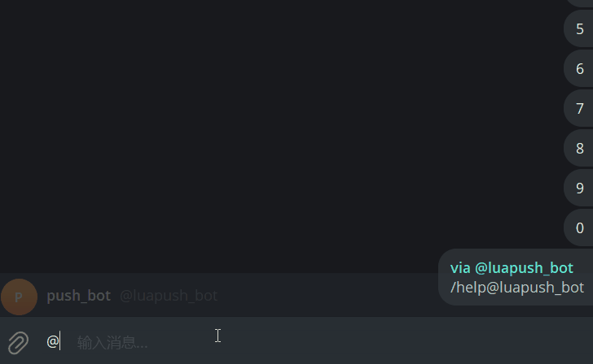

# telegram-search-bot

[中文文档](docs/zh/readme.md)

A Telegram Bot for searching group chat records by keywords and usernames

Telegram's built-in search supports only whole sentences for languages like CJK, and does not support word segmentation. This project solves the search problem by storing chat records and performing database queries.

### Index
- [Features](#features)
- [Installation](#installation)
- [Usage](#usage)
- [Update Records](#changes)
- [Contributors](#contributors)
- [License](#license)

### Features
- Searching group chat messages by multiple keywords (with pagination)
- Locating message positions
- Command control with restrictions
- Supporting queries across multiple groups (determining whether the user is a group member)
- Supporting username search
- Synchronizing database updates after message edits

### Installation

Refer to [quick-start.md](docs/en/quick-start.md) for general installation instructions.

For advanced usage, see [advanced-use.md](docs/en/advanced-use.md)

### Usage

- `@YourBot @Username keyword1 keyword2... page` Here are some examples:

  `@YourBot` Display all records, defaulting to page 1.

  `@YourBot * 2` Display all message records on page 2.

  `@YourBot weather 3`  Search for message records containing the keyword `weather` and flips to page 3.

  `@mybot @Taosky weather 4` Search for message records containing the keyword "weather" and the group member "Taosky" (full name) and flips to page 4.

- `/help`: Get search help.

- `/chat_id`:  Get the numerical ID of the current chat.

### Changes

#### 2024-06-27
- Fix message leak to non group members([#65 by JasonKhew96](https://github.com/Taosky/telegram-search-bot/pull/65))

#### 2024-03-28

- i18n support (en_US,zh_CN)

#### 2024-03-26

- Give tips when /start failed ([#57](https://github.com/Taosky/telegram-search-bot/issues/57))

#### 2023-09-07

- Fixed error when importing historical records
- Fixed issue with updating edited messages

#### 2023-09-05

- Fixed issue with reading chat IDs when importing historical records
- Fixed potential incorrect message links in userbot mode ([#41](https://github.com/Taosky/telegram-search-bot/issues/41))
- Python dependency compatibility

#### 2023-07-08

- Improved logging
- Added condition to execute corresponding threads only in userbot mode

#### 2023-07-01

- Organized directory files
- Modified documentation

#### 2023-06-24

- **Happy Dragon Boat Festival!**
- Added userbot mode
- Refined documentation

#### 2023-05-17

- Updated package versions
- Added functionality to search by user
- Attempted to make documentation clearer

more

#### 2022-11-26

- Optimized historical records import method
- Resolved memory explosion issue with Python JSON reading

#### 2022-11-23 ([#24](https://github.com/Taosky/telegram-search-bot/pull/24))

- Some optimizations and refinements

#### 2022-11-12

- Built image to ghcr.io ([#22](https://github.com/Taosky/telegram-search-bot/pull/22))
- Some minor changes, improved configuration and explanations

#### 2022-11-06

- Fixed issue with message links not redirecting correctly

#### 2022-10-31 ([#21](https://github.com/Taosky/telegram-search-bot/pull/21))

- Support for database synchronization after message editing
- Fixed some bugs

#### 2022-10-24 ([#19](https://github.com/Taosky/telegram-search-bot/pull/19))

- Optimized logic for sending /help in inline mode
- Better permission control
- Changed usage of quotes when referencing messages

#### 2022-06-15

- Fixed issue with mismatched Chat IDs when importing historical records
- Fixed issue with duplicate Message IDs
- Fixed error when importing historical records

#### 2022-02-17

- Records and searches now support multiple groups (database has changed, historical records need to be reimported)
- User names are now displayed with "@group" to distinguish message sources when searching
- Search results are now filtered based on whether the user is a member of the group

#### 2022-02-13

- WebHook mode and docker-compose
- Fixed authentication issue in inline mode
- Fixed error when text is empty

#### 2022-02-08

- Web interface for importing historical messages (port 5006)

#### 2022-01-06

- Dockerized

#### 2021-09-20

- Updated python-telegram-bot library
- Refactored code, simplified operations

#### 2021-07-03

- Added support for searching multiple keywords

#### 2021-02-04

- Fixed issue with some keyword results not displaying in inline mode (caused by parsing errors with specific characters)

#### 2020-01-11 (V1.0)

- Added ability to import historical message records. (Only available for initializing the database, and cannot be located)
- Added original message link mode, available for supergroups, allows clicking on links to locate messages

#### 2019-04-27

- Added proxy option (Shadowsocks' socks5 seems to be not working, http works)

#### 2019-04-02

- Fixed repeated reporting time issue.
- Improved README.

#### 2019-03-03

- Fixed pagination issue in searches.

#### 2019-03-02

- Rewrote a large amount of code, replaced MYSQL database with SQLITE, used ORM, simplified subsequent development and user configuration.
- Added configuration for excluding IDs
- Added repetition of images, videos, voice messages, and audio
- Added command to obtain database of group members
- Filter robot information during storage
- Bot username no longer needs to be set manually
- Fixed issue where users with no permission under administrator mode could not repeat messages.

## Contributors

## License

[MIT](LICENSE) © Taosky
