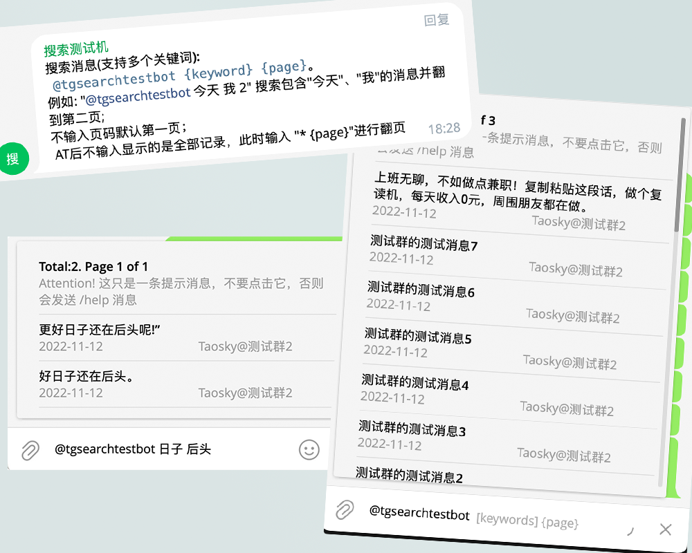

# telegram-search-bot

一个支持关键词和用户名搜索群聊记录的Telegram Bot

Telegram自带搜索对CJK等语言的支持仅限于整句，不支持关键词（3202年中仍未支持）。本项目通过存储聊天记录，进行数据库查询，解决搜索问题。

### 目录

- [功能](#功能)
- [安装](#安装)
- [使用方法](#使用方法)
- [提示](#提示)
- [更新记录](#更新记录)
- [贡献者](#贡献者)
- [License](#license)

### 功能

- 群聊消息记录和多个关键词搜索（可翻页）
- 定位消息位置
- 带限制的命令控制
- 支持多群组查询（判断是否群成员）
- 支持用户名搜索
- 消息编辑后数据库同步更新

### 安装

如无特殊需求参照[doc/quick-start.md](doc/quick-start.md)

特殊用法见[doc/advanced-use.md](doc/advanced-use.md)

### 使用
-  `@你的Bot @用户名 关键词1 关键词2... 页码`: 用于搜索，以下是几个搜索的例子
   
	 `@mybot ` 显示全部记录，默认第`1`页；
	 
	 `@mybot * 2` 显示全部消息记录的第`2`页；

	 `@mybot 天气 3` 搜索包含关键词`天气`的消息记录并翻至第`3`页

	 `@mybot @Taosky 天气 4` 搜索群成员`Taosky`（full name关键词）的包含`天气`关键词的消息记录并翻至第`4`页

- `/help`: 获取搜索帮助
- `/chat_id`: 获取当前Chat的数字ID

### 更新记录

#### 2023-05-17
- 更新包版本
- 新增按用户搜索功能
- 尝试把文档写的清晰点

#### 2022-11-26
- 优化历史记录导入方式
- 解决Python Json读入内存爆炸问题

#### 2022-11-23 ([#24](https://github.com/Taosky/telegram-search-bot/pull/24))
- 一些优化和整活

#### 2022-11-12 
- 构建镜像到ghcr.io([#22](https://github.com/Taosky/telegram-search-bot/pull/22))
- 一些小改动，完善配置和说明

#### 2022-11-06 
- 修复了导入消息链接无法跳转问题

#### 2022-10-31 ([#21](https://github.com/Taosky/telegram-search-bot/pull/21))
- 支持消息编辑后数据库同步更新

#### 2022-10-30 ([#21](https://github.com/Taosky/telegram-search-bot/pull/21))
- 支持索引频道、匿名管理消息。
- 修复了一些 BUG

#### 2022-10-24 ([#19](https://github.com/Taosky/telegram-search-bot/pull/19))
- 优化了在 inline mode下发送 /help 的逻辑
- 更好的权限控制
- 修改了引用消息时引号的用法

more

#### 2022-06-15
- 修复导入历史记录Chat ID不匹配的问题
- 修复Message ID重复的问题
- 修复导入历史记录报错的问题

#### 2022-02-17
- 记录和搜索支持多个群组（数据库有变化，要重新导入历史记录）
- 搜索时用户名后显示"@群组"用于区分消息来源
- 在搜索时，根据用户是否为群组成员筛选搜索结果

#### 2022-02-13
- WebHook模式及docker-compose
- 修复inline mode没有鉴权问题
- 修复text为空时报错问题

#### 2022-02-08
- Web界面可导入历史消息（5006端口）

#### 2022-01-06
- Docker化

#### 2021-09-20
- 更新python-telegram-bot库
- 重构代码，简化操作

#### 2021-07-03
- 支持多关键词搜索

#### 2021-02-04
- 修复inline mode部分关键词结果不显示问题（特定字符导致的解析错误）

#### 2020-01-11 (V1.0)
- 新增导入历史消息记录。（仅初始化数据库可用，且无法定位）
- 新增原消息链接模式，超级群组可用，通过点击链接定位消息

#### 2019-04-27
- 添加代理选项（酸酸乳的socks5貌似不行，http可用）

#### 2019-04-02
- 修复重复报时。
- 完善README。

#### 2019-03-03
- 修复搜索的页码问题。

#### 2019-03-02
- 重写了大量代码，更换MYSQL数据库为SQLITE，使用ORM，简化后续的开发及方便用户配置。
- 增加排除ID的配置
- 增加图片、视频、语音、音频的复读
- 增加群员获取数据库的命令
- 存储信息过程中过滤机器人的信息
- Bot的用户名无需手动设置
- 修复管理员权限模式下的无权限不能复读的问题。

## 贡献者

## License

[MIT](LICENSE) © Taosky
